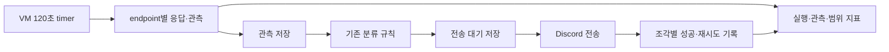

# 인덱싱 지연과 Discord 알림 편차 수정 설계

상태: 수정 설계 제안. 구현·운영 전환 전.
기준 코드: `0e9dfcaf7b073ee88a8dfe787dbef9514c6516e0`.
범위: 실행 간격, 외부 피드 관측, 후발 게시물·본문 보강, 전송 재시도와 상태 이전.

이 문서는 [기존 갱신 설계](2026-09-22-watcher-refresh-design.md)의 단계 A·B 및 지연/전송 관련 계약을 구체화한다. 해당 범위에서 충돌하면 이 문서를 우선한다. 기존 단계 C의 분류 정책·힌트 묶음은 별도 작업으로 유지하고 이번 수정의 선행 조건에서 제외한다. [기존 구현 계획](../plans/2026-09-22-watcher-refresh.md)의 Task 4→5→6 의존관계를 그대로 실행하지 않는다.

## 1. 문제와 확인한 근거

전체 경로는 `X 원문 → 제공자 수집·피드/캐시 → 우리 수집 → 판정·전송 대기 → Discord`다. 외부 피드가 늦게 글을 노출할 가능성은 있지만 현재 로그만으로 제공자 내부 인덱싱 지연을 확정하거나 수치로 분리할 수 없다.

- 30분 설정과 달리 최근 Actions 시작 시각은 2026-09-21 16:57:09Z, 20:56:41Z, 23:59:29Z, 2026-09-22 04:38:15Z였다. 실행 사이에 약 3~4시간 39분의 공백이 있다. 마지막 실행 자체는 28초였다. [실행 기록](https://github.com/chjh6107/help-me-tibooo/actions/runs/35687631087)
- 일반 뉴스는 처리한 최대 ID보다 작은 글을 후보에서 제외한다. 실제 `run_watcher`에 103~107을 먼저, 처음 보는 101·102를 나중에 입력하면 후발 두 글이 발송되지 않는다. 이 코드 경로는 재현됐지만 운영의 특정 누락이 이 원인이라는 증거는 아직 없다.
- 같은 ID의 본문이 보강돼도 이미 본 ID와 기준점 때문에 재분류되지 않는다. JSON·HTML 중 먼저 채택된 본문이 후속 근거를 가리는 병합도 있다.
- 상태 파일의 `seen_ids`는 최근 500개뿐이고, 분류에서 제외한 글도 들어간다. 이를 전체 발송 이력으로 사용할 수 없다.
- SourceTransport는 현재 요청 헤더를 curl 연결로 전달하지 않는다. 조건부 GET을 추가할 때 헤더 전달까지 검증해야 한다.

[기존 조사](../../research/2026-09-22-watcher-investigation.md)와 [이번 토론·검증 기록](../../research/2026-09-22-indexing-latency-review.md)에 근거와 반례를 남긴다.

## 2. 목표와 범위

- 유료 X API·LLM API를 사용하지 않는다. Python 3.12 이상과 기존 HTTP·파서·Discord 코드를 재사용한다.
- 사용자가 준비하는 AWS 또는 Oracle Linux VM에서 120초 간격으로 수집한다. 실제 서버 제공과 접근 검증은 운영 전환의 조건이다.
- 정상 관측한 후발 글은 현재 최대 ID와 무관하게 정책을 적용한다. 소스에 한 번도 나타나지 않은 글을 만들어 복구하지 않는다.
- 관측·판정·발송 여부를 별도로 보존한다. 발송은 한 운영 프로세스만 수행한다.
- 기존 카테고리와 즉시 알림 정책을 유지한다. 분류 정확도 개선, 힌트 묶음, 부모 글 수집, 번역은 이번 범위에 넣지 않는다.
- 원문→Discord 2분 보장과 외부 발송 exactly-once를 약속하지 않는다. 기존 설치 이전의 불완전한 발송 이력도 복원했다고 주장하지 않는다.

## 3. 접근 비교

| 접근 | 장점 | 남는 문제 | 결정 |
|---|---|---|---|
| Actions cron만 줄이기 | 변경이 작음 | 실행 지연·후발 글 제외·발송 이력 부재가 남음 | 단독 해결책으로 제외 |
| VM 이전과 JSON에 최근 ID·해시 추가 | 실행 공백을 먼저 줄일 수 있음 | 이력 보존·부분 전송·재평가를 다시 직접 설계해야 함 | VM+기존 JSON은 첫 단계로 사용, 새 JSON 저장 엔진은 만들지 않음 |
| VM 이전 후 최소 SQLite 관측·전송 저장 | 후발 처리와 중복 방지에 필요한 기록을 함께 확보 | 상태 이전과 crash 테스트가 필요 | 채택, 분류기 재작성 없이 전환 |

GitHub는 예약 실행의 지연·작업 누락 가능성을 명시한다. cron 숫자만으로 정시성을 보장할 수 없다. [GitHub 공식 문서](https://docs.github.com/en/actions/reference/workflows-and-actions/events-that-trigger-workflows#schedule)

첫 VM 전환은 기존 JSON watcher를 유지한다. 그림의 SQLite 흐름은 후속 전환에서 관측·판정·전송 대기가 함께 완성된 뒤 활성화한다.

## 4. 실행과 관측 계약

### 실행기

- systemd calendar timer: `OnCalendar=*-*-* *:0/2:00`, `AccuracySec=1s`, `Persistent=true`. 동일 oneshot service와 상태 경로 잠금을 사용한다. 서비스가 실행 중이면 새 인스턴스를 겹쳐 실행하지 않는다. 이 때문에 실행이 길어지면 다음 수집이 늦어진다는 점도 계측한다. [systemd 원문](https://github.com/systemd/systemd/blob/main/man/systemd.timer.xml)
- `watch --require-existing-state`는 상태 부재·손상 시 발송 전에 실패한다. 최초 설치 초기화는 별도 명시적 명령이다.
- shadow는 운영 파일과 다른 경로에 쓰고 Discord transport를 호출하지 않는다. 심볼릭 링크·하드 링크로 운영 파일을 가리키는 경우도 거부한다.
- 단계 A JSON watcher는 `TimeoutStartSec=180`을 사용하되 강제 종료의 중복 창을 기록한다. SQLite 단계는 수집 45초·전송 45초의 별도 예산을 두고 남은 작업은 영속 대기로 넘긴다. 요청당 상한은 15초와 해당 단계 남은 예산 중 작은 값이다. 예산 소진은 별도 결과로 기록하고 endpoint 시작 순서를 순환해 뒤쪽 소스의 반복 누락을 막는다.
- 실행 시작 간격과 endpoint별 실제 요청 간격을 둘 다 측정한다. 2분에 프로세스만 시작하고 수집을 건너뛰는 실행은 정상 수집으로 세지 않는다.

### 소스 수집

- `codex-reset.com/api/feed`와 `/tibo`는 서로 다른 endpoint지만 같은 provider다. 독립 제공자 두 곳으로 세지 않는다.
- endpoint별 파싱 성공 관측을 남긴다. HTML 실패 때문에 정상 JSON을 버리지 않는다. 한 endpoint 실패는 다른 endpoint의 관측 저장을 취소하지 않는다.
- 확정 리셋 페이지네이션은 끝까지 성공해야 그 회차의 완전한 목록으로 채택한다. 중간 실패·페이지 상한 초과·예산 소진 때도 이미 파싱한 관측은 저장하되 이전 정상 snapshot을 덮어쓰거나 baseline을 완료시키지 않는다. 이미 초기화된 소스의 유효한 관측은 처리할 수 있다. 신규 소스는 완주 전까지 초기 관측을 baseline 후보로만 누적한다.
- 느린 페이지를 매번 첫 페이지부터 반복하지 않도록 SQLite 단계는 `crawl_generation`, 시작·최종 진행 시각, 다음 cursor, 완료 페이지 수, 관측 membership을 영속한다. 다음 run에서 이어가고 전체 10페이지 상한은 generation 전체에 적용한다. 30분 동안 완료하지 못하거나 cursor가 거부·반복되면 generation을 incomplete로 종료한 뒤 새로 시작한다. 관측은 남긴다. 진행 중에도 최신 첫 페이지 확인을 정상 폴링 대상으로 유지하고 continuation과 실행 기회를 번갈아 배정한다. `complete`는 이 기간에 제공자 pagination을 끝냈다는 뜻이며 제공자가 보장하지 않는 단일 시점 snapshot의 일관성을 뜻하지 않는다.
- provider의 429는 재요청 가능 시각을 저장하고 지킨다. 대기 중인 endpoint 대신 다른 provider는 계속 관측한다. 실측 없이 전체 비동기 재작성은 하지 않는다.
- 리셋 API는 확정 기록만 사용한다. 예정·예측은 확정 알림으로 취급하지 않는다.

### 저장할 시각과 식별자

| 값 | 의미 |
|---|---|
| `run_id`, `started_at`, `finished_at` | 우리 실행 식별과 UTC 시각 |
| `request_started_at`, `response_received_at`, `observed_at` | endpoint 요청 시작, 본문 수신 완료, 파싱 성공 시각. 다른 소스가 끝날 때까지 기다렸다 한꺼번에 찍지 않음 |
| `origin_at`, `origin_time_basis` | 사건 시각과 근거(`x_source_field`, `x_snowflake`, `provider_observed`, `unknown`). ID에서 계산한 값을 독립 X 조회로 표현하지 않고, 제공자 관찰 사건과 원문 발표 시각의 분포도 분리 |
| `provider_visible_at` | 제공자가 그 의미를 명시한 경우에만 저장. `announced_at`·응답 생성 시각을 대신 넣지 않음 |
| `first_observed_at` | canonical 게시물을 우리가 처음 파싱해 얻은 시각 |
| `first_evidence_observed_at` | 첫 자동 발송 판정이 사용한 정확한 근거 해시가 완성된 파싱 시각. A를 t0, 보강 B를 t1에 봤다면 t1. 구성 관측의 가장 이른 시각으로 대체하지 않음 |
| `decision_at`, `enqueued_at` | 판정과 발송 대기 확정 시각 |
| `first_attempt_at`, `part_succeeded_at`, `completed_at` | 첫 전송 시도, 조각 성공, 전체 조각 완료 시각 |

canonical key는 X 글이면 `x:<id>`, 원문 X URL 없는 제공자 사건은 `provider:<provider>:<id>`다. provider 사건을 추정으로 X 글과 합치지 않는다. 최초 관측 시각은 저장소 유실 이전까지 알고 있다고 주장하지 않으며 측정 epoch를 함께 기록한다.

HTTP 상태, 오류 종류, snapshot membership, head/tail/count, 의미 있는 내용 해시와 응답 표현 해시(`representation_hash`), 표현별 최초 관측 시각, `last_checked_at`, 요청에 사용한 validator, 응답의 `Date`, `Age`, `Cache-Control`, `ETag`, `Last-Modified`도 남긴다. 토큰·본문 전체·인증 헤더는 운영 metrics에 남기지 않는다.

### 캐시와 최신성

- 캐시 헤더는 응답 표현의 캐시 근거다. `Age=0`, HTTP 200, ETag 변경이 외부 크롤러의 최신성을 보증하지 않는다.
- 조건부 GET은 이전 성공 body와 validator를 함께 저장한 뒤에만 켠다. cache key는 provider·정규화 URL/query/cursor·request variant·parser 호환 버전을 포함한다. transport는 `User-Agent`, `Accept`, `If-None-Match`, `If-Modified-Since`만 명시적으로 전달하며 인증·Cookie·Host를 복사하지 않는다.
- 304는 본래 본문 없이 저장된 표현을 재검증하는 응답이다. 같은 요청 variant에 사용 가능한 캐시 표현이 있으면 `last_checked_at`을 갱신하되 원문·근거·해당 표현의 최초 관측 시각은 유지한다. 캐시 표현이 없으면 validator 없이 한 번 재조회한다. 같은 표현 해시의 200도 최초 시각을 유지한다. [HTTP 캐시 표준](https://www.rfc-editor.org/rfc/rfc9111.html#section-4.3.4)
- 현재·직전 정상 snapshot membership의 교집합이 있으면 `overlap`, 없거나 실패하면 `unknown`이다. 이전 head 하나가 삭제돼도 다른 공통 ID가 있으면 overlap이다. 일부 ID가 겹쳐도 그 사이 모든 글을 수집했다는 의미는 아니다. `complete`는 공식 페이지네이션을 끝낸 제공자 목록 범위에만 쓴다.
- 이전 snapshot에 글이 없었다는 사실은 제공자 전체에 그 글이 없었다는 증거가 아니다. 최근 창·정렬·캐시가 있으므로 두 관측 사이를 인덱싱 지연의 확정 구간으로 표시하지 않는다.
- 다른 provider에서 같은 ID가 먼저 보이면 endpoint별 최초 관측 차이를 계산한다. 요청 실패·간격·캐시 정보도 함께 보여주고 제공자 내부 지연으로 단정하지 않는다. 같은 provider의 두 endpoint 차이는 표현 차이로만 보고하며 독립 관측 표본 수를 늘리지 않는다. provider 상태는 available/degraded/unavailable로 한 번 집계하고 news/confirmed-reset 범위의 상태도 따로 낸다.

## 5. 지연 지표와 완료 판정

| 지표 | 계산 및 판정 |
|---|---|
| 실행 간격 | 연속 `started_at` 차이. 24시간 표본 p95 ≤150초, 계획된 중단 외 300초 초과 0건 목표 |
| endpoint 요청 간격 | endpoint별 `request_started_at` 차이, 성공/실패/429 대기/예산 소진 횟수 별도 보고 |
| 원문→최초 관측 | `first_observed_at - origin_at`. 외부 수집·캐시·우리 폴링 대기가 섞인 값 |
| 근거 대기 | `first_evidence_observed_at - first_observed_at`. 최초 본문이 불완전하거나 확정 리셋이 나중에 온 경우를 구분 |
| 자체 처리 | `completed_at - first_evidence_observed_at`. SQLite outbox 활성화 후 정상 서비스 조건 p95 ≤60초 목표. `enqueued_at`·`first_attempt_at` 기준의 저장/대기/전송 구간도 함께 보고 |
| 전체 지연 | `completed_at - origin_at`. 게시 시각을 알 수 없는 사건은 미측정 |
| 대기·실패 | 미완료 이벤트 수, 가장 오래된 대기 나이, 60초 초과 수, 실패/재시도/차단 수 |

전송 완료 건만 골라 p95를 내고 성공으로 선언하지 않는다. 해당 기간에 들어온 알림 대상 총수·완료수·미완료수·제외 사유를 함께 낸다. 명시적 429 대기와 외부 장애는 정상 조건 SLO에서 분리하되 전체 지연·대기 지표에는 포함한다. 0건이면 미측정, 20건 미만이면 개별 지연·최대값과 참고 p95를 보고하고 충분한 표본의 성능 검증으로 취급하지 않는다. 음수 시각차는 0으로 보정하지 않고 시각 불일치로 분리한다.

수집 정상, 원천 최신성 unknown, 후발 관측, 소스 실패, Discord 대기는 각각 다른 상태다. 최신 원문의 나이가 많다는 이유만으로 작성자 활동이나 소스 장애를 추정하지 않는다.

## 6. 후발 글과 본문 보강 정책

### 일반 뉴스

최대 ID는 관측 요약·과거 상태 이전에만 사용한다. 새로운 runtime에서 계속 증가하는 최대 ID를 일반 뉴스 제외 조건으로 사용하지 않는다.

1. canonical ID와 provider·endpoint·의미 있는 내용 해시로 관측을 저장한다. 해시는 본문, 원문 URL, reply/repost 구분, 제공자 태그 및 확정 리셋 근거를 포함하되 상대시간 표시·수집 시각·HTML 배치는 제외한다.
2. 아래 baseline·legacy 억제 근거를 평가한다. 억제된 항목도 관측·판정·사유는 남긴다.
3. 억제되지 않은 신규 근거는 `origin_at ≤ evidence_first_observed_at ≤ origin_at + 7일`일 때 자동 알림 후보로 삼는다. UTC 기준 양 끝 포함이다. 7일은 제안하는 알림 정책이며 제공자의 최대 인덱싱 지연을 뜻하지 않는다.
4. 원문 시각 불명·미래 시각·7일 초과는 audit-only로 보관한다. 전송 시점이 7일을 넘었다는 이유로 이미 만들어진 대기를 취소하지 않는다.
5. 기존 `classify`를 호출해 카테고리가 있으면 전송 대기를 만든다. 동일 근거·같은 규칙 버전은 다시 판정하지 않는다. 새 규칙 버전의 과거 일괄 재평가는 자동 발송하지 않는다.

예: 기준점 107 이후 처음 나타난 101도 범위에 맞으면 평가한다. A 본문을 6.9일째 관측해 제외했고 새 B 본문이 7.1일째 도착했다면, A의 이른 시각을 빌려 B를 자동 발송하지 않는다. B가 6.9일째 전송 대기에 들어갔다면 7.1일째 재시도는 허용한다.

### 본문 선택과 캐시 회귀

- JSON·HTML·다른 provider의 원본 관측을 각각 보존한다. 단순 `setdefault`로 후속 근거를 버리지 않는다.
- 동일 ID의 유효 원문이 기존 본문을 그대로 포함하는 확장이거나 파서가 검증 가능한 잘림을 복원했다면 보강 버전으로 채택한다. 길이만 긴 임의 텍스트를 더 신뢰하지 않는다.
- 의미가 다른 본문끼리는 자동으로 문장을 합치지 않는다. 기존 채택 본문을 유지하고 `content_conflict`를 기록하며 관측 이력을 보존한다. 확정 리셋 API의 사건 근거는 이와 별도로 처리한다.
- A→B→A처럼 이미 관측한 해시가 캐시에서 돌아오면 새 버전으로 취급하거나 B를 A로 퇴행시키지 않는다. 실제 원문 수정과 오래된 캐시를 구분할 제공자 버전 정보가 없으면 충돌 상태로 남긴다.
- 미전송·억제되지 않은 항목만 새 보강 근거로 자동 대기를 만들 수 있다. 이미 대기 중인 payload와 전송 완료 메시지를 본문 변경만으로 다시 만들거나 수정하지 않는다.

### 확정 리셋

확정 리셋은 일반 뉴스 7일 정책과 분리한다. 해당 소스 초기화가 완료된 뒤 처음 확인한 확정 사건은 원문이 오래돼도 처리한다. `handled_reset_ids`, 초기 리셋 baseline, 기존 reset 발송 효과와 중복되지 않아야 한다. 최초 전체 이력 수집은 과거 리셋 일괄 발송을 하지 않는다.

## 7. 초기화와 이전 상태의 불확실성

### 신규 설치·신규 endpoint

- 첫 정상 snapshot의 실제 ID 집합을 baseline으로 저장한다. 빈 응답·파싱 실패는 초기화를 완료하지 않는다. 확정 리셋은 전체 목록 완주가 필요하고 완주 전 누적한 초기 관측도 baseline에 포함한다.
- 최초 baseline 수집 중에 작성된 글도 그 snapshot에 포함되면 초기 과거 목록으로 처리될 수 있다. 이 초기 관측 공백을 숨기지 않는다.
- baseline은 관측 출처의 처리 근거다. 신규 endpoint의 baseline이 이미 정상 운영 중인 endpoint에서 알림 대상이 된 동일 ID를 전역적으로 막지 않는다. 같은 run에서 관측을 ID별로 합쳐 판단한 뒤 신규 endpoint 초기화를 확정한다.
- 같은 baseline 본문의 반복 관측은 새 알림 근거가 아니다. 이미 확보한 알림 자격을 baseline 표시로 되돌리지 않는다.
- baseline-only였던 일반 뉴스는 본문 보강 뒤에도 자동 발송을 억제하고 판정만 갱신한다. 확인 가능한 원문 수정 시각이 없어 새로운 편집과 과거 본문의 늦은 복원을 구분할 수 없기 때문이다. 같은 run에 이미 자격 있는 기존 endpoint 근거가 있어 애초 baseline-only가 아니었던 경우와 별도 확정 리셋은 예외다.

### 기존 JSON → SQLite

- 원본 v4 JSON 전체와 checksum을 보존한다. 과거의 `seen_ids`를 `sent`로 바꾸지 않고 `legacy_handled_unknown`으로 수입한다. 과거 설치 시각을 migration 시각으로 만들어내지 않는다.
- 같은 저자의 X 뉴스 domain에서 비교 가능한 모든 legacy checkpoint·deferred checkpoint의 최댓값을 **고정된 이전 기준점**으로 저장한다. 이후 새 관측으로 이 값을 올리지 않는다. 서로 다른 provider 고유 사건이나 다른 저자에게는 적용하지 않는다.
- 이 기준점 이하의 이력 불명 ID는 첫 snapshot뿐 아니라 나중에 나타나도 audit-only다. 500개 이력 밖으로 밀린 과거 발송 글의 재전송을 막기 위한 정책이며, 실제 미발송 과거 글도 자동 복구하지 못한다는 비용을 명시한다. 같은 domain의 모든 이전 기준점보다 새 글임을 안전하게 비교할 수 없으면 자동 발송하지 않는다.
- 예: A checkpoint=200, B=100일 때 B에 뒤늦게 나타난 unknown 150은 audit-only다. A에서 이미 보냈을 가능성이 있기 때문이다. 201 이후 관측된 207 다음에 들어온 203은 현재 최대값과 관계없이 최근 7일 정책으로 처리한다.
- `alert_delivery.post_id`와 `pending_ids`는 명시적 미완료 예외다. 고정 기준점·legacy seen·새 일반 뉴스 7일 제한보다 먼저 기존 자격을 복원한다. deferred checkpoint 아래에 있다는 이유로 버리지 않는다. 본문 없는 pending ID는 나중에 실제 관측을 얻었을 때 기존 분류 정책으로 처리하며 원문을 만들어내지 않는다.
- 부분 발송은 기존 카테고리·기존 렌더러로 확정한 payload·`next_payload_index`를 그대로 수입한다. 이전 조각은 `legacy_completed`로 표시하고 알 수 없는 과거 message ID·성공 시각을 만들어내지 않는다. 일반 pending ID만 있고 본문이 없으면 `awaiting_observation`으로 유지한다.
- `handled_reset_ids`는 초기화/처리 완료 억제 근거로 보존한다. 실제 과거 발송 시각까지 안다고 해석하지 않는다. 장애 횟수·서명·복구 대기 상태도 이전한다.
- endpoint의 초기화도 이전한다. 기존 `reset` checkpoint가 있으면 `/api/feed`와 `/tibo`를 모두 `established_from_legacy`로 매핑하고, `twiscan` checkpoint는 해당 타임라인, `resets` checkpoint는 확정 리셋 endpoint에 매핑한다. 과거에 각 endpoint가 실제 성공한 시각·membership을 새로 만들어내지는 않는다. 이 endpoint들은 첫 SQLite snapshot을 새 baseline으로 삼지 않고 고정 이전 기준점·handled IDs·pending 예외를 적용하므로 전환 중의 새 글을 처리할 수 있다.
- 해당 source checkpoint가 없는 endpoint는 `uninitialized`로 남겨 실제 첫 정상 snapshot으로 초기화한다. 단, v1의 `LEGACY(*)`는 당시 뉴스 source 둘(`reset`, `twiscan`)의 공통 이전 기준점으로 확장하며, 당시 없던 확정 리셋 source를 초기화된 것으로 만들지 않는다. 초기화 여부를 `initialized=true` 한 값으로 모든 endpoint에 복제하지 않는다. 동일 제공자에 URL을 새로 추가하는 경우도 이 고정 migration 매핑에 자동 포함하지 않는다.
- 이전 작업은 source JSON checksum을 식별자로 사용해 재실행 안전하게 만든다. 운영 DB에 새 발송이 시작된 뒤 다른 과거 JSON을 재수입해 덮어쓰는 동작은 거부한다.

## 8. 저장과 발송 계약

### 작은 Interface를 가진 Module

| Module | 외부 Interface와 책임 |
|---|---|
| `sources.py` | `fetch_source_snapshots(client, clock, budget)` → snapshot iterator. endpoint 응답 또는 pagination 페이지 파싱 직후 yield하여 전체 수집 완료 전에 저장할 수 있게 함. HTTP·파싱·시각·캐시 근거를 소유 |
| `pipeline.py` | `ingest_run(store, snapshots, classify, now)` → 관측·이전 상태 억제·판정·전송 대기 결과. 분류 함수는 기존 adapter를 주입 |
| `storage.py` | `SqliteStore.stage_snapshot(run_id, snapshot)`으로 관측·crawl 진행을 즉시 확정. 나머지는 트랜잭션, 고유 제약, migration, read report를 소유하며 호출자에게 SQL 작성 순서를 노출하지 않음 |
| `delivery.py` | `deliver_due(store, send, clock, budget)` → 전송·조각 진행·대기/실패. 수집 성공에 의존하지 않음 |
| `diagnostics.py`, `runtime.py` | 지표 출력, 경로 검증·잠금·실행 예산. 판정 정책을 넣지 않음 |

위 Interface는 설계 계약이며 아직 구현된 함수가 아니다. 수집 중에는 endpoint별 관측을 즉시 내구성 있게 저장하되 판정·enqueue·baseline 확정은 하지 않는다. 수집 단계가 완료되거나 45초 예산에 도달한 시점을 barrier로 삼아 `ingest_run`이 해당 run의 이용 가능한 관측을 canonical ID별로 합쳐 한 번 판정한다. 이때 신규 endpoint baseline과 기존 자격의 우선순위를 결정한다. 판정·전송 대기·효과 예약·초기화 확정은 하나의 트랜잭션으로 처리한다. 따라서 먼저 응답한 endpoint가 불변 payload를 너무 일찍 고정하지 않는다.

관측 저장 직후 crash로 끝난 run은 `incomplete`로 남는다. 다음 run의 barrier에서 그 미판정 관측과 새 관측을 함께 처리하고, 사용한 관측들을 같은 트랜잭션에서 판정 완료로 표시한다. 전송 대기까지 확정된 이전 run은 다시 합쳐 payload를 바꾸지 않는다. 수집이 모두 실패해도 기존 미판정 관측과 due 전송을 처리한다.

### 최소 영속 기록

| 기록 | 키·보존할 핵심 정보 |
|---|---|
| runs / snapshots | run ID, endpoint, 요청·응답·관측 시각, 응답 상태/캐시 근거, membership, partial/complete, coverage |
| posts / observations | canonical ID; provider·endpoint·내용 해시; 원문·시각 근거; 근거 최초/최종 관측 시각 |
| eligibility | canonical ID·근거·출처, baseline/legacy/age 억제 또는 알림 자격과 이유 |
| decisions | canonical ID·선택 근거 해시·규칙 버전, 카테고리, 결정 시각 |
| notifications / parts | destination·canonical ID·발송 종류; 확정 payload, 조각 번호, due/not_before, 시도 수, 결과·message ID·성공 시각 |
| notification_effects | destination·canonical ID·효과(`news`, `reset`) unique, 소유 notification과 reserved/completed 상태 |
| runtime / migration | 소스 초기화, pagination generation/cursor, 고정 이전 기준점, 이전 checksum, pending/장애 상태, scope별 발송 차단 시각 |

SQLite 표준 라이브러리, 외래키 활성화, bound parameter, 명시적 트랜잭션을 사용한다. 네트워크 전송 동안 DB 트랜잭션을 잡지 않는다. 백업은 `sqlite3.Connection.backup()`으로 만들고 복원 검사를 한다. [Python 공식 문서](https://docs.python.org/3.12/library/sqlite3.html)

본문·상세 snapshot은 90일 보관한다. 알림 효과·legacy 억제·baseline·근거 해시의 최소 식별 기록은 삭제하지 않는다. pending payload와 미판정 관측은 기간이 지났다는 이유로 지우지 않는다. 내용 삭제 뒤 같은 글을 새 게시물로 재생성하지 않는다.

### 발송 순서와 중복

- 모든 소스가 실패한 run도 기존 due 알림은 처리한다. Discord가 실패해도 새 관측과 판정 저장은 계속한다.
- 수집 장애·복구 알림도 동일 outbox·scope 대기·발송 예산을 사용한다. 건강 상태 변화마다 영속 `transition_id`를 부여해 중복 enqueue를 막고, 실제 성공 후에만 통지 완료로 표시한다. 건강 알림의 key는 `health:<transition_id>`로 posts 외래키를 요구하지 않으며 게시물 news/reset 효과를 예약하지 않는다. 복구 전송 대기 중 재장애면 오래된 복구를 취소하고, 장애 통지 성공 전에 정상화되면 오래된 미전송 장애를 취소한다. 이미 성공한 전송은 되돌리지 않는다. 동일 상태는 시간 경과만으로 반복 통지하지 않고, 이전에 성공한 장애 통지가 있을 때만 복구 알림을 만든다.
- 조각은 notification 안에서 순서대로 보낸다. 명시적으로 성공 기록이 남은 조각은 재전송하지 않는다. 대기 payload는 불변이다.
- 같은 run에 일반 뉴스와 확정 리셋 근거가 같이 있으면 카테고리를 합쳐 한 notification으로 보낸다.
- 게시물의 첫 notification은 출처가 확정 리셋 API여도 news 효과를 예약한다. RESET을 포함하면 reset 효과도 같이 예약한다. 따라서 확정 리셋을 먼저 알리고 나중에 동일 글이 일반 피드에 나타나도 일반 알림이 추가되지 않는다.
- 일반 소스에서 이미 RESET 카테고리를 포함한 notification을 만들었다면 reset 효과도 함께 예약한다. 그것이 pending/completed인 동안 같은 ID의 확정 API 기록이 와도 추가 reset notification을 만들지 않는다.
- NEWS-only notification 뒤 확정 리셋이 오면 reset 효과를 새로 예약해 한 번 더 알릴 수 있다. effect unique 제약과 enqueue를 같은 트랜잭션으로 묶는다. 영구 실패는 blocked로 남기고 효과 예약을 자동 해제하지 않는다.
- 공정성의 선택 단위는 notification 전체가 아니라 **다음 전송 가능한 조각 1개**다. 한 run은 최대 20개 조각을 시도하며 새 notification의 첫 조각과 진행 중/재시도 due 조각을 번갈아 고른다. 각 그룹 안에서는 마지막 시도 시각이 가장 오래된 notification부터 선택한다. 시도 시각·다음 조각 cursor·다음 그룹 차례를 영속하므로 재시작해도 큰 새 메시지가 먼저 예산을 독점하지 않는다. 처리 가능한 한쪽만 있으면 그쪽을 진행한다. 독립 notification의 5xx/실패 때문에 뒤 알림을 삭제하지 않는다. 예산 때문에 못 보낸 항목은 대기에 남고 지표에 포함한다.
- 429의 `Retry-After` 또는 응답 `retry_after`를 읽어 `not_before`를 저장한다. 현재의 10초 상한으로 대기 시간을 줄이지 않는다. 같은 Discord channel/bucket 또는 global scope에 속한 다른 notification도 그 시각 전에는 보내지 않는다. [Discord 공식 문서](https://docs.discord.com/developers/topics/rate-limits)
- 5xx·네트워크 오류는 시도별 120/240/480/960/1800초(이후 1800초) 대기를 저장한다. 401/403은 발송 경로를 blocked로 두고 운영자가 자격증명·권한을 복구한 뒤 명시적으로 재개한다. 실패한 메시지를 보내려고 수집 프로세스가 수분 동안 sleep하지 않는다.
- Discord가 수신한 직후 로컬 성공 저장 전에 죽거나 요청 timeout이 나면 중복 가능성이 남는다. 불확실 시도를 별도 기록하고 재시도한다. exactly-once나 임의의 성공 이력을 만들지 않는다.

### 수집 상태 전이

news와 confirmed-reset 범위별로 판단하며 미확인 결과를 실패·복구로 단정하지 않는다. news는 유효한 비어 있지 않은 타임라인 endpoint 하나로 수집 가능, confirmed-reset은 유효한 목록 완주로 정상 판정한다. partial 리셋 관측의 저장·발송과 건강 상태의 정상 판정은 별개다.

| 이번 범위 관측 | 실패 횟수·알림 처리 |
|---|---|
| 사용 가능한 정상 수집/캐시 표현 재검증, reset은 완주 | 연속 실패 0. 성공한 장애 통지가 있으면 복구 1회 대기 |
| 범위를 제공하는 모든 endpoint가 실제 시도 후 HTTP 실패·빈/잘못된 응답으로 끝남 | 연속 실패 +1. 세 번의 확정 실패 평가 뒤 장애 대기. 실제 요청의 429도 실패 1회에 포함 |
| 일부 endpoint 실패, 나머지 예산 소진으로 미시도 | 범위 unknown. 횟수 유지, 복구·새 장애로 승격하지 않음 |
| 모든 endpoint 미시도, 저장된 429 not-before 대기 | 횟수 유지. skipped/deferred와 마지막 성공 경과 시간 기록 |
| pagination이 예산 내 진행 중이며 아직 미완료 | unknown. 횟수 유지, 정상 snapshot/baseline promotion 없음 |
| pagination generation이 HTTP 오류·cursor 오류·30분 만료·10페이지 초과로 종료 | 해당 generation 실패 1회. continuation마다 중복 가산하지 않음 |

성공한 소스가 있고 다른 소스만 실패하면 provider별 degraded를 남긴다. 범위 unknown이 오래 지속되는 상황은 3회 실패 알림으로 위장하지 않고, endpoint 실행 공백·마지막 완전 수집 시각과 외부 운영 점검에서 드러낸다. 장애/복구 transition은 이 평가 결과와 이전의 실제 통지 성공 상태로 만들며 source 실패 횟수를 Discord 실패 횟수로 증가시키지 않는다.

## 9. 구현 순서와 전환

| 순서 | 산출물과 주요 파일 | 통과 조건 |
|---|---|---|
| 1 | `models.py`, `sources.py`, `source_transport.py`, 신규 `diagnostics.py`: endpoint별 관측·시각·실패·캐시 계약과 shadow | JSON 정상/HTML 실패에도 JSON 관측 보존, 상대시간 변화로 해시 불변, shadow Discord 호출 0회 |
| 2 | 신규 `runtime.py`, `deploy/systemd/*`, `__main__.py`, workflow와 VM runbook: 기존 JSON 안전 이전 | 상태 부재 실패, 단일 writer, 최신 cache 이전, 실제 VM 24시간 실행 간격 검수 |
| 3 | 신규 `storage.py`, `pipeline.py`: 후발·보강·baseline/legacy 판정과 기존 classify adapter | 107 뒤 101, 7일 경계, 캐시 회귀, frozen fence, 신규 endpoint 충돌 테스트 통과. 별도 DB shadow만 사용 |
| 4 | 신규 `delivery.py`, `discord.py`, 상태 migration: 최소 outbox와 reset 효과 예약 | 조각 재개, 긴 429, 영구 실패와 수집 지속, enqueue/crash 회복. 3·4 함께 운영 활성화 |
| 5 | `README.md`, runbook: SQLite 전환과 실제 지연 검수 | epoch·총 대상/완료/대기 포함 보고, 백업 복원, 재부팅, 단일 발송 주체 검증 |

각 단계의 코드 작성 전에 아래 인수 시나리오를 실제 호출 경로의 실패 테스트로 작성한다. 운영 코드 변경에 대한 상세 작업 계획은 이 설계의 계약을 기준으로 작성하며, 기존 계획의 새 classifier/digest 작업을 선행시키지 않는다.

### Actions → VM JSON

1. VM에서 Python·curl_cffi와 공개 소스 접근을 smoke/shadow로 검증한다. ARM이면 설치만이 아니라 실제 요청 성공까지 확인한다.
2. 준비 코드만 배포할 때는 Actions를 계속 운영한다. 전환 직전에 예약·수동 watch 모두 차단하고 실행 중 writer 종료를 확인한다.
3. **state cache save step이 성공한 가장 최신 watch**의 exact key를 고른다. 전체 job이 실패한 run에도 최신 pending이 있을 수 있다. run ID/attempt·state version·checksum manifest와 함께 read-only export한다. export는 발송하지 않는다.
4. 최신 상태를 `/var/lib/help-me-tibooo`에 설치·검증하고 VM에서 한 번 실행한 뒤 timer를 켠다. shadow state는 운영으로 승격하지 않는다. cache가 없으면 자동 baseline으로 진행하지 않는다.
5. VM host 정지는 그 VM 내부 timer가 검출할 수 없다. 사용자가 선택한 클라우드의 외부 점검을 실제 연결·시험한 경우에만 host 감시 완료로 표시한다.

### VM JSON → SQLite

1. JSON writer를 정지한 뒤 최신 JSON을 백업한다. shadow DB는 비교 자료로만 보존한다.
2. 새 운영 DB에 frozen fence, 모든 legacy suppression, pending 조각·ID, reset 처리 근거, 장애/복구를 수입한다. checksum과 roundtrip을 검사한다.
3. 미판정 관측의 재처리와 effect reservation을 검증한 뒤 SQLite 지원 runtime 한 개만 활성화한다. 새 초기화 또는 상세 분류 정책 변경을 동시에 하지 않는다.
4. sender 시작 전에는 원 JSON으로 되돌릴 수 있다. SQLite로 실제 발송한 뒤에는 최신 DB를 읽는 호환 바이너리로만 되돌린다. 오래된 Actions cache나 JSON으로 자동 복귀하지 않는다. 과거 백업 복원은 중복 위험이 있는 별도 재해 복구다.

## 10. 인수 시나리오

| 번호 | 입력·장애 | 필수 결과 |
|---|---|---|
| A1 | baseline 이후 103~107, 다음 run 처음 보는 최근 101·102 | 둘 다 판정되고 카테고리가 있으면 각각 1회 전송 |
| A2 | 같은 ID의 무관한 A → 유효한 본문 보강 B → 캐시 A | B로 재판정, A로 퇴행·추가 발송 없음 |
| A3 | 같은 근거 100회 재수집 | 최초 시각·판정 유지, 추가 대기 없음 |
| A4 | 7일 직전/정확히 7일/7일 초과/미래/시각 불명 | 앞의 두 경우만 일반 뉴스 자동 후보; 나머지 사유 있는 audit-only |
| A5 | 7일 내 enqueue 후 7일 밖에서 재시도 | 기존 대기 유지·재시도 |
| A6 | JSON 성공+HTML 실패, 동일 ID의 보강·충돌 | 정상 관측 보존, 보강만 채택, 충돌 이력 유지 |
| A7 | 신규 endpoint baseline과 기존 endpoint eligible ID 동시 등장 | 기존 자격 유지, 실제 전송 1회 |
| A8 | A legacy fence 200/B100, seen 500개에서 사라진 150이 두 번째 snapshot에 등장 | legacy 불확실 억제, 자동 재전송 없음 |
| A9 | fence 아래 alert_delivery/pending ID | pending 복원, 성공한 조각 제외, 새 정책으로 payload 변경 없음 |
| A10 | 정상 초기 리셋 목록, 이후 뒤늦은 오래된 확정 리셋 | 초기 이력 억제, 새 확정 사건은 7일 밖이어도 1회 |
| A11 | 일반 RESET notification pending/완료 뒤 동일 confirmed record | 추가 reset 발송 없음. NEWS-only였다면 추가 reset 1회 |
| A12 | Discord 429 65초, 같은 channel의 다음 notification | 65초 전 해당 scope 재시도 없음, 수집·저장 지속 |
| A13 | 첫 notification 403/5xx, 새 게시물 도착 | 관측·판정 저장 지속, 403 scope 차단/5xx 개별 backoff 보존 |
| A14 | 관측 저장 직후·enqueue 직후·조각 성공 저장 직후 재시작 | 미판정 관측 재처리, 중복 enqueue 없음, 성공 기록 조각 재전송 없음 |
| A15 | Discord 수신 후 로컬 기록 전 crash/timeout | 불확실 시도 표시, 중복 가능성 명시; 보장된 무중복으로 테스트하지 않음 |
| A16 | 304, 같은 variant의 캐시 표현 없음/있음 | 없으면 무조건 GET 1회, 있으면 동일 표현 재검증. 최초 관측 시각 불변 |
| A17 | 리셋 중간 페이지 실패·요청 예산 소진·최대 페이지 초과 | 파싱한 관측 보존, complete/baseline 승격 안 됨 |
| A18 | source 429/장애, 이전 outbox 존재 | source 상태와 별개로 허용된 Discord 전송 진행 |
| A19 | 모든 알림 미완료 또는 표본 0 | 성공 p95로 덮지 않고 미완료·미측정 보고 |
| A20 | 상태 부재/손상, 중복 writer, 최신 failed-job cache, 재부팅 | 조용한 초기화·이중 발송 없음, 최신 pending·억제 기록 보존 |
| A21 | cursor 페이지별 200/304·동일/다른 표현 해시·parser 버전 변경 | 캐시 격리, 올바른 최초/재검증 시각, 호환 안 되는 캐시 재사용 없음 |
| A22 | 이전 head만 사라짐, 같은 provider 두 endpoint, cached absence | membership overlap 유지, provider 중복 집계 없음, provider_visible_at을 추정하지 않음 |
| A23 | baseline-only A가 B로 보강됨 | 판정 이력만 갱신, 일반 뉴스 과거 일괄 발송 없음 |
| A24 | 느린 reset 페이지가 run 예산을 넘음 | cursor·관측 보존 후 다음 run 진행, 최신 첫 페이지 관측도 기회 보장, 완주 전 baseline 승격 없음 |
| A25 | 게시물 429 뒤 health/recovery, 미전송 복구 뒤 새 장애 | 같은 scope gate 적용, 오래된 복구 대기 취소, 새 전환은 고유 ID로 기록 |
| A26 | 첫 endpoint 뉴스 뒤 같은 run confirmed, 또는 관측 저장 뒤 crash | barrier에서 ID별 통합, 미완료 run 관측 복구, 불변 payload의 조기 enqueue 없음 |
| A27 | legacy reset만 초기화된 상태에서 SQLite 전환 | 두 codex-reset endpoint는 established, 미초기화 twiscan/resets는 신규 baseline, 전환 중 새 뉴스 보존 |
| A28 | 미시도·예산 소진·429 대기·부분 pagination | 전이표대로 횟수 유지/실패 1회/정상 초기화, 허위 복구 없음 |
| A29 | 새 20조각 알림과 오래된 retry 동시 due, 매 run 재시작 | 조각 단위 교대 유지, 기존 retry가 계속 뒤로 밀리지 않음 |

완료는 위 시나리오, 실제 VM 24시간 실행 간격, 전송 표본과 미완료 현황을 모두 확인한 뒤 판정한다. 설계 작성 시점에는 코드가 수정되지 않았으므로 기존 후발 누락 재현은 여전히 실패하는 것이 정상이다.
