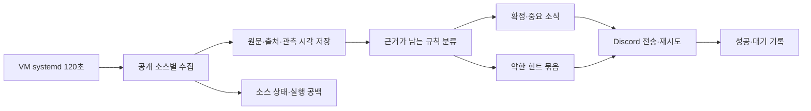

# 티보햄 갱신·분류 개선 설계

상태: 조사와 에이전트 검토를 반영한 제안. 구현·배포 전.

후속 수정: 실행 지연·후발 글·상태 이전·전송 정합성은 [인덱싱 지연 수정 설계](2026-09-22-indexing-latency-design.md)를 우선한다. 아래 분류 정책·힌트 묶음은 별도 제안으로 남으며 지연 수정의 선행 조건이 아니다. 첫 migration snapshot만의 baseline, 최초 게시물 관측 기준 7일, event_kind만의 중복 방지로 구현하지 않는다.

기준: `0e9dfcaf7b073ee88a8dfe787dbef9514c6516e0`.
조사: [운영 조사](../../research/2026-09-22-watcher-investigation.md), [비교 사이트 조사](../../research/2026-09-22-codex-resets-benchmark.md).

## 목표와 제약

- 유료 X API·LLM API를 사용하지 않는다.
- 사용자가 준비하는 AWS 또는 Oracle Linux VM에서 운영한다. 특정 무료 티어의 가용성·영구 무료 여부는 전제하지 않는다.
- Python 3.12 이상, 기존 HTTP/파서/Discord 코드를 재사용한다.
- Tibo 원글·답글의 리셋, 한도, 출시, 요금제, 장애·복구를 감시하고, 근거가 약한 힌트는 별도 취급한다.
- 원문과 X 링크를 보존하고 멘션을 발생시키지 않는다.
- 운영 전환 중 발송 주체는 한 곳이다. 수집만 하는 검증 실행은 별도 상태를 쓴다.
- 최초 초기화 시 과거 글을 일괄 발송하지 않는다. 기존 상태가 분실된 운영 실행은 조용히 재초기화하지 않는다.
- Actions는 CI·수동 진단으로 남긴다. 기존 30분 schedule은 전환 완료 때 끈다.
- 기존 설계의 'Actions 실행' 제약은 이번 사용자 답변으로 서버 운영 허용으로 변경한다. '유료 API 없음'은 유지한다.

## 측정 가능한 완료 기준

| 지표 | 목표 | 의미 |
|---|---|---|
| 서버 감시 시작 간격 | 기본 120초; 24시간 표본에서 p95 ≤150초, 계획된 중단 외 5분 초과 공백 0건 | 우리 실행기의 목표. 측정 후 채택 |
| 즉시 알림 처리 | 최초 자체 관측→Discord 성공 p95 ≤60초, 정상 외부 서비스 조건 | 힌트 묶음과 명시적 rate-limit 대기 제외, 제외 건수 별도 보고 |
| 원문→알림 | 게시 시각과 전송 시각을 기록하고 분포 보고 | 상류 최초 노출 시각이 없으면 원인별 분해 불가; 2분 보장 금지 |
| 커버리지 | 확인한 source snapshot의 미처리 ID 0, 창 단절 탐지 | 한 번도 소스가 제공하지 않은 글까지 완전 수집한다고 주장하지 않음 |
| 분류 품질 | 고정 평가셋의 확정 중요 공지 recall ≥95%, 즉시 알림 precision ≥90% | 목표치이며 현재 성능 수치가 아님. 클래스별·표본수 함께 기록 |
| 회복 | 재시작/일시 HTTP 실패/부분 Discord 전송 시 기존 대기 항목 보존 | 외부 전송의 완전한 exactly-once는 보장하지 않음 |

페이지 HTTP 200, 테스트 성공, '수집 정상'만으로 위 조건을 통과했다고 판정하지 않는다. 24시간에 알림 표본이 없으면 전송 p95는 미측정으로 남기고 fixture 검증과 구분한다.

## 접근 비교와 선택

1. **채택: Python + 사용자 VM + systemd.** 먼저 기존 JSON 상태를 영속 디스크로 이동해 실행 간격을 개선한다. 이후 SQLite로 관측·판정·전송 기록을 분리한다.
2. **보조로 유지: Actions만 개선.** 계측·분류 개선은 가능하지만 관측된 수시간 실행 공백 때문에 신속 알림의 실행 기반으로 채택하지 않는다.
3. **제외: codex-resets 단독 의존.** 공개 확정 리셋 API는 유용하지만 전체 Tibo 뉴스 API가 아니므로 출시·요금·장애 감시를 대체하지 않는다.

그림의 관측/판정/전송 분리는 두 번째 단계의 목표다. 최초 서버 전환은 현 watcher 흐름과 JSON을 유지한다.

## 단계 A: 실행 기반과 계측

- `/opt/help-me-tibooo`에 검증된 릴리스를 설치하고 `/var/lib/help-me-tibooo/watcher.json`에 상태를 보관한다.
- systemd timer가 2분마다 같은 oneshot service를 실행한다. 전용 사용자, 영속 디렉터리, 프로세스 잠금으로 수동 실행과도 중복되지 않게 한다.
- 상태가 필수인 운영 실행과 최초 초기화를 명시적으로 구분한다. 손상·분실 상태는 오류로 종료한다.
- shadow 실행은 Discord 호출 없이 수집·판정 결과를 별도 파일에 기록한다. shadow의 처리 완료 상태를 운영으로 승격하지 않는다.
- `run_id`, `started_at`, `finished_at`, source별 `fetched_at`, 최신 원문 시각, 건수, 소요시간, 오류, 게시물별 최초 관측/판정/전송 시각을 기록한다. 확인되지 않은 상류 최초 게시 시각은 null로 둔다.
- 이전 anchor의 snapshot 포함 여부와 head/tail/count를 기록한다. overlap이 없으면 `coverage=unknown`으로 남기며 전체 수집 장애와 구분한다.
- 기존 JSON의 tmp→replace 원자 교체를 유지하고 잠금을 추가한다. SQLite를 서버 이전의 선결조건으로 만들지 않는다.
- 전체 호스트가 꺼지면 같은 호스트의 점검기도 알릴 수 없다. 외부 dead-man 점검은 실제 선택한 클라우드의 모니터를 연결할 때 검증한다. Actions schedule을 정시 dead-man으로 취급하지 않는다.

## 단계 B: 수집과 저장의 정합성

- 기존 두 codex-reset URL은 동일 제공자다. `/api/feed`와 `/tibo`를 별도 관측으로 보관한 후 같은 X ID로 합친다. 어느 한 응답 실패 때문에 정상 응답을 버리지 않는다.
- 합칠 때 먼저 나온 본문/태그를 무조건 고정하지 않는다. 원문 버전, 본문 길이·정상성, 제공자 태그의 출처를 남긴다. 서로 상충하는 태그는 확정 사실로 승격하지 않는다.
- SQLite에 게시물, 소스별 관측, 분류 판정, 전송 대기를 둔다. baseline 완료 후 처음 나타난 새 ID는 과거 기준점보다 작아도 평가한다. 일반 뉴스는 원문 시각이 최근 7일 이내인 경우에 자동 알림 대상으로 삼고, 더 오래됐거나 시각을 알 수 없으면 audit-only로 남긴다. 새 확정 리셋은 별도 이벤트 정책을 적용한다. 이미 보낸 이벤트는 ID·이벤트 종류·조각 번호로 중복을 막는다.
- 신규 설치는 source별 첫 정상 snapshot의 ID 목록을 baseline으로 저장한다. legacy에는 원래 설치 시각이 없으므로 migration_at을 설치 시각처럼 쓰지 않는다. 전환 시 기존 known IDs는 자동 재전송 금지로 수입하고, 첫 정상 snapshot에서 legacy checkpoint 이하인 unknown ID는 audit-only baseline에 넣는다. checkpoint 이후 새 ID는 전환 공백에 발생한 글일 수 있으므로 기존 eligibility로 평가한다. `baseline_completed_at`과 snapshot membership을 endpoint별로 기록한다. baseline 이후 후발 ID는 최근 7일 정책으로 평가한다. legacy 기간의 완전한 전송 이력 복원은 불가능하다고 명시한다. 마이그레이션은 기존 source checkpoints/seen_ids/handled_reset_ids/부분 전송을 모두 수입한다. 이미 '본 글'과 '전송한 글'을 구분할 수 없는 legacy ID는 임의로 미전송이라고 추정하지 않는다.
- 본문·제공자 근거가 바뀌면 내용 해시와 판정 버전으로 재평가한다. 동일 이벤트가 이미 전송됐으면 판정만 갱신한다. 뒤늦은 확정 리셋은 별도의 `confirmed_reset` 이벤트로 1회 보낼 수 있다.
- 소스가 반환하는 최근 창이 이전 관측과 전혀 겹치지 않으면 gap 의심으로 남긴다. 문서화된 페이지/커서가 있을 때만 backfill한다. 없으면 `coverage=unknown`으로 표시한다.
- 소스 하나 실패해도 정상 소스 관측은 저장한다. 429/Retry-After를 존중하고, 공개 API의 cache TTL을 속도 평가에 포함한다. 브라우저용 비문서화 API를 기본 수집 계약으로 채택하지 않는다.

## 단계 C: 무료 규칙 기반 분류의 정책

분류 결과는 범주만 반환하지 않고 `immediate | digest | ignore`, 이유 코드, 근거, 규칙 버전을 가진다.

| 사례 | 기본 정책 |
|---|---|
| 확정 리셋 공개 API | 리셋 즉시 알림. 예측·예정 상태와 합치지 않음 |
| 구체적인 제품·요금·한도 변경 또는 장애/복구 | 해당 범주 즉시 알림, 중복 범주 허용 |
| 출처의 `limits` 태그만 있고 본문 근거 없음 | 태그를 보조 근거로 보관; 한도로 단정하지 않음 |
| 제품명+이모지·감탄·홍보만 있는 답글 | 힌트 묶음 후보, 즉시 중요 소식으로 격상하지 않음 |
| Tibo의 업무·제품 공개 예고, 제품명 미기재 | 명시적인 공개 일정/행동과 저자 근거가 있으면 예고 묶음. 출시 확정으로 부풀리지 않음 |
| 인용/부모 문맥 미확보 | 문맥 부족 기록; 존재하지 않는 내용을 추정하지 않음 |
| 단순 리포스트·명확한 잡담 | 무시, 이유 기록 |

힌트는 30분에 최대 1회 묶고, 마지막 성공 이후 새 후보가 있을 때만 전송한다. 원문과 링크를 유지한다. 확정 리셋과 중요 공지는 묶음을 기다리지 않는다. 종합 confidence 숫자를 정규식 점수로 만들어 '확률'처럼 표시하지 않는다.

평가셋은 실제 공개 원문과 경계 사례를 포함한다. 최소 80건(확정 중요 30, 힌트/예고 20, 무관/리포스트 30), 출처·기대 등급·이유를 남긴다. 같은 원문의 복제는 독립 평가 표본으로 세지 않는다. 날짜 기준으로 규칙 조정용과 미사용 평가용을 나눠 결과를 따로 보고한다.

## 상태와 장애 의미

- 소스별 `fetch_ok`, `coverage`, `latest_post_at`, `last_fetch_at`을 구분한다.
- 최신 글이 오래됐다는 사실은 작성자가 조용할 수 있어 단독 장애 조건이 아니다.
- reset/news 각각 정상·일부 소스 실패·수집 불가를 표시한다. 타임라인 하나 성공했다고 확정 리셋 경로 실패를 숨기지 않는다.
- 전송 대기 건수와 가장 오래된 대기 시간을 별도 표시한다. 소스 정상·Discord 실패를 구분한다.
- 원문 저장→판정/전송 대기 생성은 트랜잭션으로 묶고, 성공 메시지 ID·조각 진행을 남긴다. 전송 성공 직후 프로세스가 죽으면 확인되지 않은 중복 창은 남는다. 이를 문서와 회복 테스트에 명시한다.

## 전환과 되돌리기

1. 실제 VM에서 공개 소스 smoke와 shadow를 수행한다. VM/ARM 아키텍처의 Python·curl_cffi 설치와 네트워크 접근도 이때 확인한다.
2. Actions의 예약·수동 watch 발송을 막고 실행 중인 watch가 끝나는 것을 확인한다.
3. 가장 최근에 state cache save step이 성공한 watch run의 정확한 key에서 JSON을 read-only export한다. 전체 job 실패에도 최신 pending 상태가 저장될 수 있으므로 job 성공 여부로 고르지 않는다. run ID/attempt·버전·checksum manifest를 함께 보관한다. 수동 export는 watch를 실행하지 않는다. 복사본의 버전·체크포인트·부분 전송 상태를 검증한다.
4. 최신 운영 상태를 VM에 설치한 뒤 즉시 한 번 실행하고 timer를 켠다. shadow 상태는 사용하지 않는다.
5. 24시간 간격·수집·전송·재시작 검수 후 운영을 확정한다.
6. 되돌리기는 먼저 VM writer를 끄고 최신 상태를 보존한 뒤 같은 상태 형식을 읽는 직전 VM 바이너리로 한다. Actions로 자동 복귀하지 않는다. SQLite 전환은 delivery까지 완성된 뒤 수행하며, 이후에는 SQLite를 이해하지 못하는 구버전 JSON watcher로 바로 되돌리지 않는다. 오래된 DB 백업 복원은 이미 보낸 메시지를 재전송할 수 있어 별도 재해복구 절차로 취급한다.

## 회의에서 제외한 제안

- cron만 5분으로 변경하고 해결됐다고 판단하기.
- 세 소스를 모두 비동기로 바꾸는 일을 최우선으로 두기: 관측된 병목이 아니다.
- 유료 X/LLM API, 자동 번역 모델, 자체 LLM 상시 구동을 필수화하기.
- Kafka/Redis/Celery/외부 DB/마이크로서비스를 추가하기.
- 사이트 내부 크롤러를 추정해 따라 만들거나 비공개 API에 의존하기.
- 리셋 전용 피드로 전체 뉴스 감시를 대체하기.
- 테스트 193개 성공이나 HTTP 200만으로 알림 품질·최신성을 보장하기.
